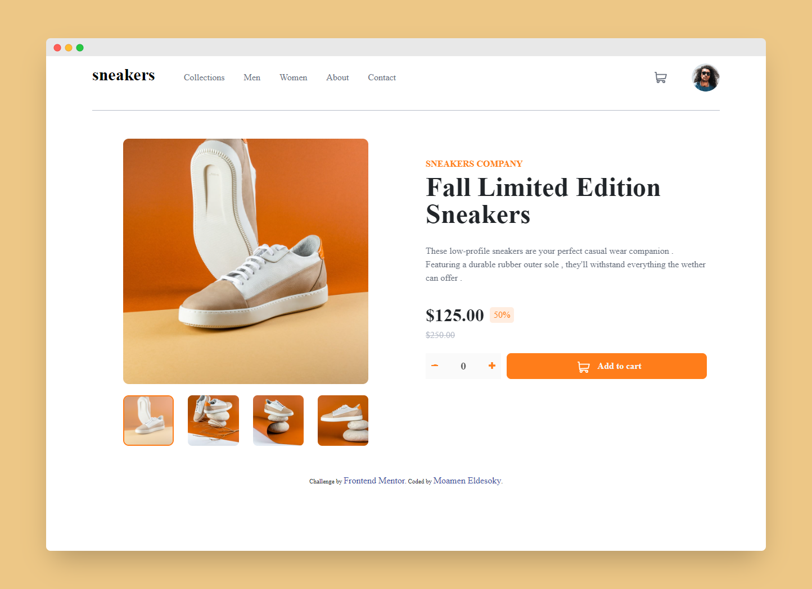

# Frontend Mentor - E-commerce product page solution

This is a solution to the [E-commerce product page challenge on Frontend Mentor](https://www.frontendmentor.io/challenges/ecommerce-product-page-UPsZ9MJp6). Frontend Mentor challenges help you improve your coding skills by building realistic projects.

## Table of contents

  - [Overview](#overview)
  - [The challenge](#the-challenge)
  - [Screenshot](#screenshot)
  - [Links](#links)
  - [Built with](#built-with)
  - [Useful resources](#useful-resources)
  - [Author](#author)

## Overview

### The challenge

Users should be able to:

- View the optimal layout for the site depending on their device's screen size
- See hover states for all interactive elements on the page
- Open a lightbox gallery by clicking on the large product image
- Switch the large product image by clicking on the small thumbnail images
- Add items to the cart
- View the cart and remove items from it

### Screenshot

### Links

- Solution URL: [Add solution URL here](https://your-solution-url.com)
- Live Site URL: [Add live site URL here](https://your-live-site-url.com)

### Built with

- Semantic HTML5 markup
- CSS custom properties
- Flexbox
- SASS
- JQUERY
- BOOTSTRAP 5

### Useful resources

- [Animate.style](https://animate.style/) - Great for emphasis, home pages, sliders, and attention-guiding hints.

## Author

- LinkedIn - [@moamen-eldesoky](https://www.linkedin.com/in/moamen-eldesoky-58039b175/)
- Frontend Mentor - [@momen-eldesoqy](https://www.frontendmentor.io/profile/momen-eldesoqy)
- Twitter - [@momen29245842](https://twitter.com/momen29245842)

